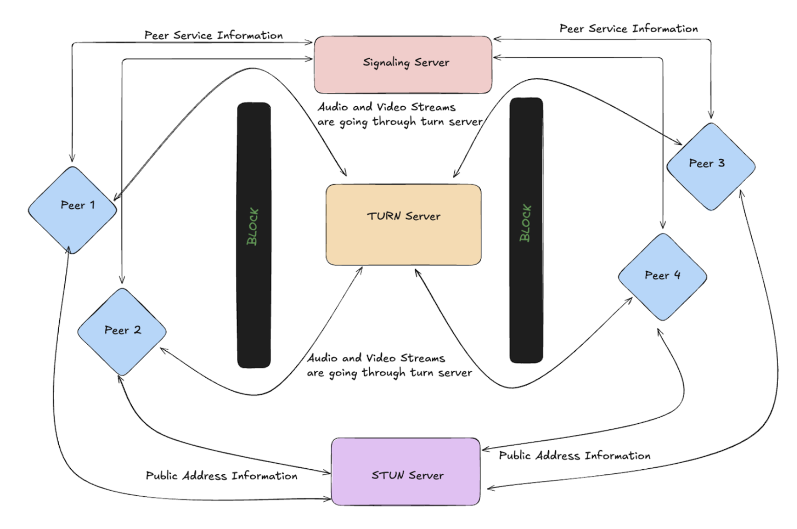

# WebRTC Network Engineering Course Project (Fall 2024)
## Table of Contents
1. [Introduction](#introduction)  
2. [Project Overview](#project-overview)  
3. [Architecture](#architecture)  
4. [Concepts](#concepts)  
5. [Technical Requirements](#technical-requirements)  
6. [Implementation Details](#implementation-details)  
7. [Additional Features](#additional-features)  
8. [Scenarios](#scenarios)  
9. [Challenges and Solutions](#challenges-and-solutions)  
10. [Questions](#questions)  
11. [Resources](#resources)  

---

## Introduction
This project focuses on developing a **real-time communication application** using **WebRTC**. The platform enables **video calls and text messaging** between multiple users, similar to Google Meet.

## Project Overview
The application supports **three users (H1, H2, H3)** and tests two scenarios:
1. **Same internal network** (without knowledge of each other's IPs).
2. **Different networks behind NAT** (requiring STUN/TURN servers).

---

## Architecture
The WebRTC architecture consists of:
- **Signaling Server:** Facilitates connection setup between peers.
- **STUN Server:** Helps peers discover their public IPs.
- **TURN Server:** Relays media streams when direct connections fail due to NAT/firewall restrictions.

### WebRTC Connection Diagram


---

## Concepts

| Concept | Description |
|---------|------------|
| **Signaling Server** | Exchanges connection setup info (SDP, ICE candidates) between peers. |
| **SDP (Session Description Protocol)** | Describes the media session for establishing WebRTC connections. |
| **STUN (Session Traversal Utilities for NAT)** | Helps peers discover their public IPs and ports. |
| **TURN (Traversal Using Relays around NAT)** | Relays media traffic when direct P2P communication is blocked. |
| **ICE (Interactive Connectivity Establishment)** | Finds the best connection path between peers. |
| **ICE Candidates** | Represents possible network paths for communication. |
| **RTCPeerConnection** | API enabling P2P audio, video, and data streaming. |
| **getUserMedia** | Allows access to the user's camera and microphone. |

---

## Technical Requirements

### **Backend**
- **Node.js Server**  
  - Acts as the **signaling server** to exchange SDP and ICE candidates.  
  - Manages WebSocket connections for real-time messaging.  

- **Coturn (TURN Server)**  
  - Relays media traffic when P2P communication fails.  

- **Google STUN Server**  
  - Resolves public-facing IPs for direct connections.  

- **VPS Deployment**  
  - A Virtual Private Server (VPS) hosts the signaling server and WebRTC components.

### **Frontend**
- **HTML/CSS/JavaScript**
  - User interface for video calls and messaging.
  - Uses `RTCPeerConnection` and `WebSockets` for media and signaling.

---

## Implementation Details

### **Server-Side**
#### **Setting Up the Node.js Signaling Server**
```javascript
import express from 'express';
import { createServer } from 'http';
import { Server } from 'socket.io';

const app = express();
const httpServer = createServer(app);
const io = new Server(httpServer, {
    cors: { origin: '*' },
});

const port = 8000;
httpServer.listen(port, () => {
    console.log(`Server started on port ${port}`);
});
```

#### **Handling WebRTC Signaling**
```javascript
socket.on('offer', (offer, targetSocketId) => {
    io.to(targetSocketId).emit('offer', offer, socket.id);
});

socket.on('answer', (answer, targetSocketId) => {
    io.to(targetSocketId).emit('answer', answer, socket.id);
});

socket.on('ice-candidate', (iceCandidate, targetSocketId) => {
    io.to(targetSocketId).emit('ice-candidate', iceCandidate, socket.id);
});
```

### **Client-Side**
#### **Accessing User Media**
```javascript
const socket = io('http://188.213.199.201:8000');
```
#### **Connecting to the Signaling Server**
```javascript
async function getLocalStream() {
    try {
        localStream = await navigator.mediaDevices.getUserMedia({ video: true, audio: true });
        localVideo.srcObject = localStream;
        socket.emit('join-call');
    } catch (error) {
        console.error('Error accessing media devices:', error);
    }
}
getLocalStream();
```
#### **Creating a Peer Connection**
```javascript
function createPeerConnection(peerSocketId) {
    const peerConnection = new RTCPeerConnection({
        iceServers: [{ urls: 'stun:stun.l.google.com:19302' }],
    });

    localStream.getTracks().forEach(track => {
        peerConnection.addTrack(track, localStream);
    });

    return peerConnection;
}
```
